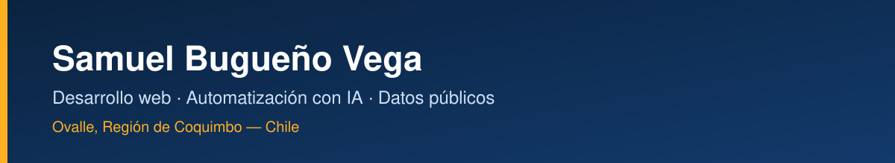
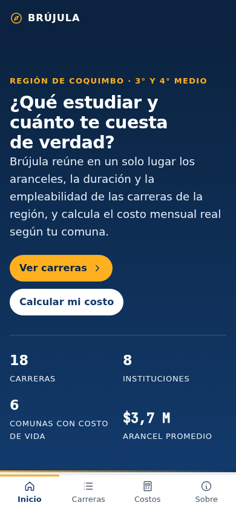
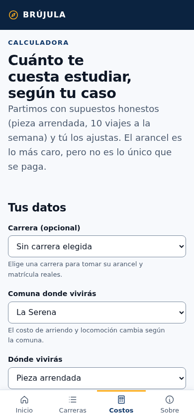
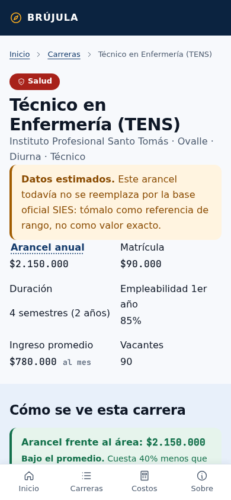
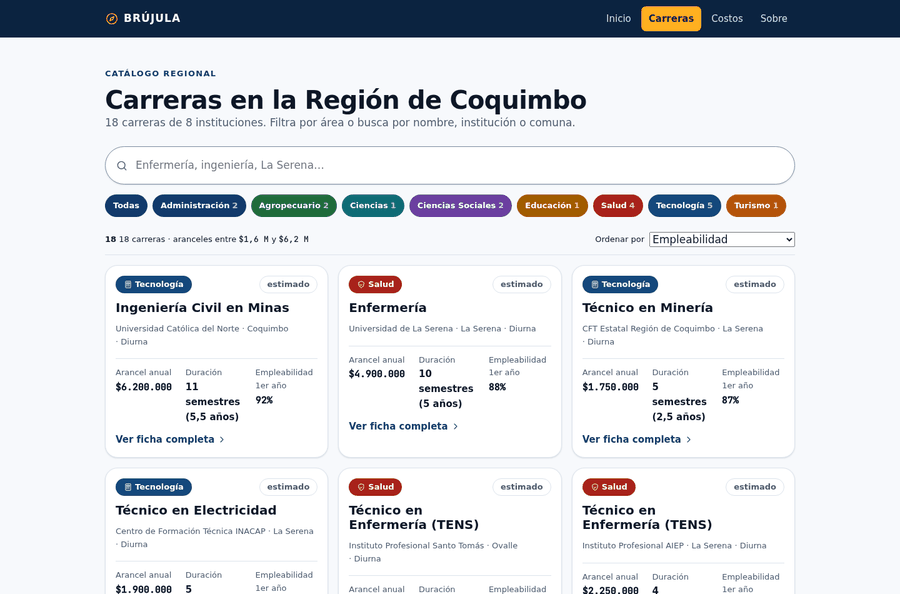

      

## Sobre mí

Desarrollador **full-stack independiente** desde Ovalle, Región de Coquimbo (Chile).
Construyo soluciones web para negocios y proyectos de interés público: menús digitales,
sistemas de pedidos, e-commerce y automatización con IA.

Me gusta llevar cada proyecto **de punta a punta** — diseño, datos, pruebas y despliegue —
y entregar productos funcionales, rápidos y fáciles de usar para gente que no es técnica.

## Lo que hago

- **Aplicaciones web** con SvelteKit 5 + TypeScript
- **Menús digitales y sistemas de pedidos** para restaurantes y negocios locales
- **E-commerce y catálogos** con carrito, tallas y checkout
- **Datos públicos**: catálogos, costos y dashboards con la fuente al pie
- **Automatización con IA** para tareas repetitivas de negocio
- **UI cuidada**: responsive, accesible (contraste AA) y rápida

## Trabajo reciente

### 🧭 Brújula — orientación vocacional y costo real de estudiar

Web para estudiantes de 3° y 4° medio de la Región de Coquimbo: **cuánto cuesta realmente
estudiar** una carrera, cuánto se gana después y qué alternativas existen cerca de casa.
Datos de fuentes públicas (SIES, INE, Mineduc), calculadora con desglose de costos y
comparación de cada carrera contra el promedio de su área.

*SvelteKit 5 · TypeScript · datos públicos · sin dependencias de UI · beta privada, demo a pedido.*

<table>
<tr>
<td width="33%"> Portada</td>
<td width="33%"> Calculadora de costos</td>
<td width="33%"> Ficha de carrera</td>
</tr>
</table>

### 🍔 Menús digitales y pedidos online

Sistemas de **menú digital con carrito y checkout** para negocios de comida y marcas de ropa,
cada uno con su panel de administración y vista para cocina/pedidos.

*SvelteKit 5 · Firebase (Firestore, Auth, Functions) · código privado de cada cliente.*

## Cómo trabajo

- **Pruebas antes de publicar:** cada entrega corre verificaciones automáticas (lógica de
  dominio, render en varios tamaños de pantalla, cero errores de consola) y no se publica si algo falla.
- **Accesibilidad y rendimiento** como parte del trabajo, no como extra.
- **Datos con fuente:** cada cifra va con su origen y su año a la vista.
- **Documentación** para que el proyecto siga vivo sin mí.

## Stack

| Capa | Tecnologías |
|------|-------------|
| Frontend | SvelteKit 5 · Svelte 5 · TypeScript · Tailwind CSS 4 · CSS propio por capas |
| Backend y datos | Firebase (Firestore, Auth, Functions) · Node.js · APIs REST |
| Pruebas | Playwright · Vitest · scripts de auditoría propios |
| Infra | Docker · GitHub Actions · despliegue en servidor propio |

---

Ovalle, Región de Coquimbo · Chile — abierto a proyectos y colaboraciones.

