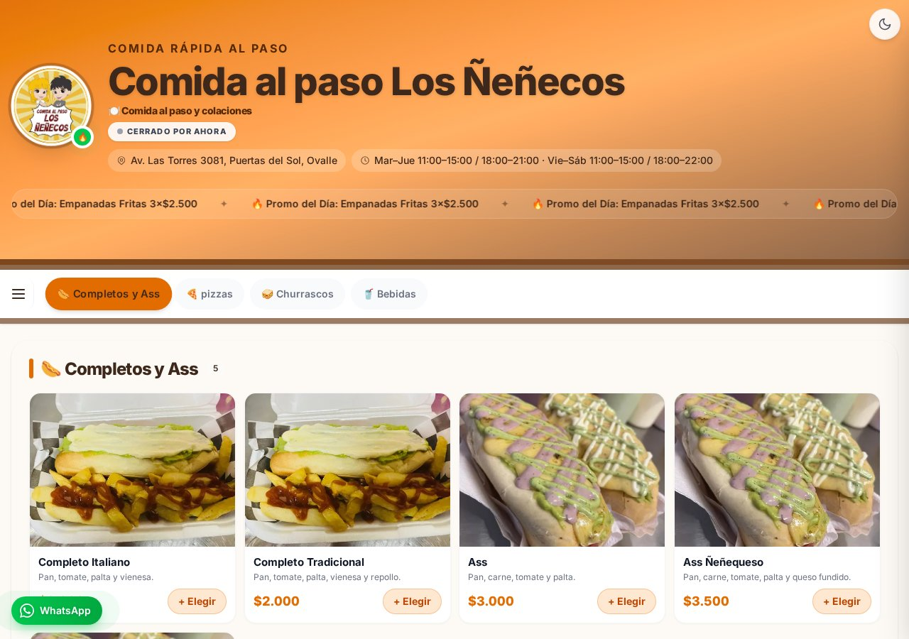
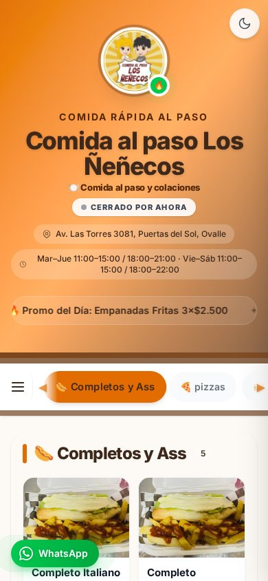
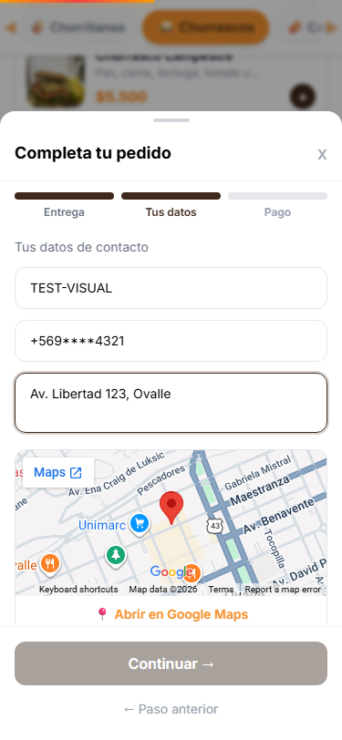
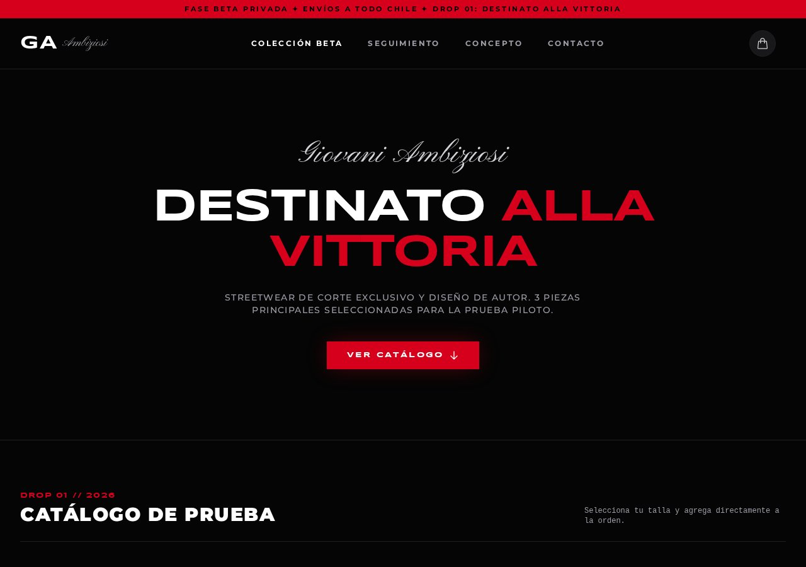
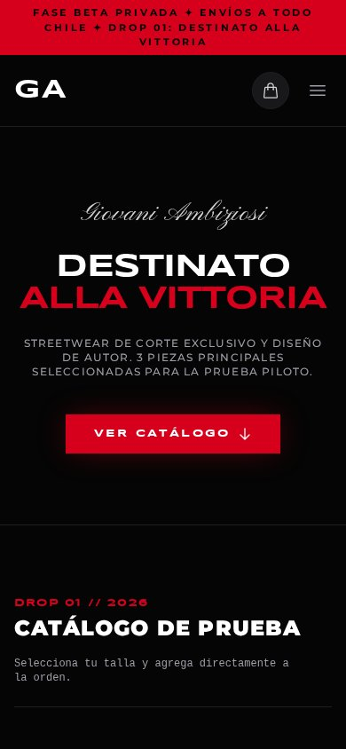

        

## Sobre mí

Desarrollador **full-stack independiente** desde Ovalle, Región de Coquimbo (Chile).
Construyo soluciones web para negocios y proyectos de interés público: menús digitales,
sistemas de pedidos, e-commerce y automatización con IA.

Me gusta llevar cada proyecto **de punta a punta** — diseño, datos, pruebas y despliegue —
y entregar productos funcionales, rápidos y fáciles de usar para gente que no es técnica.

## Lo que hago

- **Aplicaciones web** con SvelteKit 5 + TypeScript
- **Menús digitales y sistemas de pedidos** para restaurantes y negocios locales
- **E-commerce y catálogos** con carrito, tallas y checkout
- **Datos públicos**: catálogos, costos y dashboards con la fuente al pie
- **Apps Android nativas** en Java
- **Automatización con IA** para tareas repetitivas de negocio
- **UI cuidada**: responsive, accesible (contraste AA) y rápida

## Proyectos

> El código de estos proyectos es privado. **Lo que está abierto es el producto**: entrá,
> usalo y juzgalo vos mismo.

### 🧭 Brújula — orientación vocacional y costo real de estudiar

Web para estudiantes de 3° y 4° medio de la Región de Coquimbo: **cuánto cuesta realmente
estudiar** una carrera, cuánto se gana después y qué alternativas existen cerca de casa.
Datos de fuentes públicas (SIES, INE, Mineduc), calculadora con desglose de costos y
comparación de cada carrera contra el promedio de su área.

571 carreras · 18 instituciones · cada cifra con su fuente y su año a la vista.

### **[→ Abrir el sitio: brujula-coquimbo.web.app](https://brujula-coquimbo.web.app)**

*SvelteKit 5 · TypeScript · CSS propio por capas · sin dependencias de interfaz · beta en desarrollo.*

<table>
<tr>
<td width="33%"> Portada</td>
<td width="33%"> Calculadora de costos</td>
<td width="33%"> Ficha de carrera</td>
</tr>
</table>

### 🌭 Los Ñeñecos — menú digital y pedidos para un local de comida al paso

PWA de menú digital y pedidos para **Comida al Paso Los Ñeñecos** (Ovalle). El cliente entra
desde el teléfono, arma su pedido y lo envía sin instalar nada; el local lo recibe en una
pantalla de cocina.

Catálogo en vivo sincronizado con Firestore, carrito y checkout, **panel de cocina** para
seguir el estado de cada pedido, panel de administración con roles (productos, categorías,
precios y promociones), botón directo de WhatsApp, modo oscuro y QA automatizado con
Vitest + Playwright sobre GitHub Actions.

### **[→ Abrir el menú: nenekos-c1e77.web.app](https://nenekos-c1e77.web.app)**

*SvelteKit 5 · TypeScript · Tailwind CSS 4 · Firebase (Firestore, Auth, Hosting) · PWA.*

<table>
<tr>
<td width="33%"> Menú en escritorio</td>
<td width="33%"> La vista que usa el cliente</td>
<td width="33%"> Checkout paso a paso</td>
</tr>
</table>

### 🖤 GA Streetwear — e-commerce de una marca de ropa

Tienda online para la marca de streetwear **Giovani Ambiziosi** (Drop 01 · *Destinato alla
Vittoria*): catálogo con selección de tallas, estados de inventario, carrito persistente,
checkout guiado con retiro o delivery, seguimiento del pedido para el cliente y panel de
administración completo.

Es una **marca ficticia**: la armé como pieza de portafolio para construir la identidad
visual, el flujo de compra y el panel de admin de punta a punta, sin depender de un cliente
real.

<table>
<tr>
<td width="50%"> Portada (escritorio)</td>
<td width="50%"> Portada (teléfono)</td>
</tr>
</table>

*SvelteKit 5 · TypeScript 6 · Tailwind CSS 4 · Playwright · catálogo de prueba, sin backend real.*

### 📦 BodegaExpress — gestión de bodega en Android

App Android **nativa en Java** que cubre el ciclo completo de una bodega: inicio de sesión con
roles, alta, edición y búsqueda de productos, registro de entradas y salidas con validación de
stock, dashboard de indicadores y alerta de stock bajo.

La resolví como sistema, no como ejercicio: capas separadas (`data` · `model` · `ui` · `util`)
sobre un repositorio con semilla de datos, y un módulo de UI propio con vistas reutilizables
(cabeceras de sección, campos de formulario y badges de estado) en lugar de repetir la
interfaz pantalla por pantalla.

*Android SDK nativo · Java · Gradle Kotlin DSL · RecyclerView · ConstraintLayout.*

## Cómo trabajo

- **Pruebas antes de publicar:** cada entrega corre verificaciones automáticas (lógica de
  dominio, render en varios tamaños de pantalla, cero errores de consola) y no se publica si algo falla.
- **Accesibilidad y rendimiento** como parte del trabajo, no como extra.
- **Datos con fuente:** cada cifra va con su origen y su año a la vista.
- **Documentación** para que el proyecto siga vivo sin mí.

## Stack

| Capa | Tecnologías |
|------|-------------|
| Frontend | SvelteKit 5 · Svelte 5 · TypeScript · Tailwind CSS 4 · CSS propio por capas |
| Móvil | Android nativo · Java · Gradle KTS · componentes de UI reutilizables |
| Backend y datos | Firebase (Firestore, Auth, Functions) · Node.js · APIs REST |
| Pruebas | Playwright · Vitest · scripts de auditoría propios |
| Infra | Docker · GitHub Actions · despliegue en servidor propio |

---

Ovalle, Región de Coquimbo · Chile — abierto a proyectos y colaboraciones.

